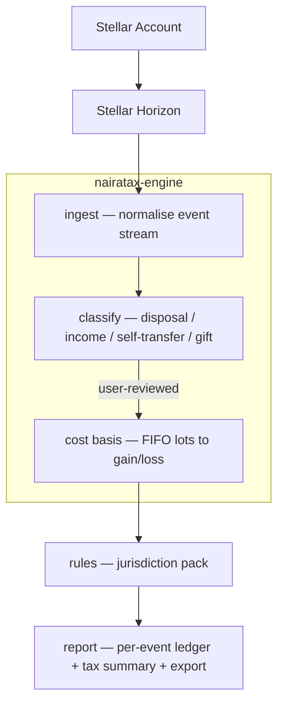

# NairaTax

[](https://github.com/nairatax-xyz/nairatax-xyz/actions/workflows/ci.yml)
[](https://stellar.org)
[](LICENSE)

**On-chain tax reporting for the Stellar ecosystem.** NairaTax reads a Stellar
account's real activity, works out which movements are taxable, applies a
jurisdiction's rules, and produces a filing-ready report of what's owed —
starting with Nigeria.

## Overview

NairaTax turns raw Stellar ledger activity into a tax position. It ingests an
account's full history from Horizon, classifies each movement, computes
realised gains and losses, applies a jurisdiction's rules as data rather than
hard-coded logic, and outputs a per-event ledger with a summary of tax owed.

### The Problem

Nigeria's Tax Act 2025 took effect on 1 January 2026: crypto is taxed as
property, disposals fold into personal income tax at progressive rates, and
the NRS (formerly FIRS) now cross-references exchange data. Traders and
builders need an accurate way to compute what they owe from on-chain
activity — and most existing tools ignore the Nigerian rule set entirely.

### What NairaTax Does

At a high level, it does three things:

- **📥 Reads** — pulls an account's full on-chain history from Stellar Horizon (payments, DEX trades, path payments, claimable balances), no manual CSV wrangling
- **🧮 Computes** — classifies every movement, matches disposals to acquisitions via FIFO, and applies a jurisdiction's rules as auditable data rather than magic numbers
- **📄 Reports** — produces a clear per-event ledger and a summary of tax owed, exportable for records or an accountant

## Features

- **Reads the chain**: Pulls an account's full history from Stellar Horizon (payments, DEX trades, path payments, claimable balances) — no manual CSV wrangling
- **Classifies events**: Sorts every movement into taxable disposals, income, self-transfers, and gifts, with a review step so nothing is guessed silently
- **Computes cost basis**: FIFO matching of disposals against acquisitions to get realised gains and losses
- **Applies the rules**: Jurisdiction rule packs live as auditable data, not magic numbers — starting with Nigeria (NTA 2025)
- **Reports**: A clear per-event ledger plus a summary of tax owed, exportable for records or an accountant

See [docs/methodology.md](docs/methodology.md) for the reasoning behind
FIFO-across-your-portfolio, how swaps are treated as a disposal and an
acquisition at once, and how netted gains/losses get taxed once and
allocated back to individual ledger lines.

## Architecture



### Core Components

- **ingest**: Pulls payments, DEX trades, path payments, and claimable balances from Stellar Horizon into a normalised in/out/swap event stream — `nairatax-engine`
- **classify**: Sorts every event into disposal, income, self-transfer, or gift, with a user-review step so nothing is guessed silently — `nairatax-engine` (logic), `nairatax-web` (review UI)
- **cost basis**: FIFO matching of disposals against acquisitions to produce realised gains and losses — `nairatax-engine`
- **rules**: Jurisdiction rule packs as auditable data, not hard-coded logic (e.g. `nigeria-nta-2025`) — `nairatax-rules`
- **report**: Per-event ledger plus a tax-owed summary, exportable for records or an accountant — `nairatax-web`

## Repository Structure

This repo (`nairatax-xyz`) is the org landing page and currently also hosts
the reference implementation of the pipeline described above — ingestion,
classification, FIFO cost basis, rules, and reporting — as a Python package,
pending a split into `nairatax-engine` / `nairatax-rules` (see
[NairaTax Organization](#nairatax-organization)).

```
nairatax-xyz/
│
├── README.md              ← This file
├── CONTRIBUTING.md        ← Dev workflow + project conventions
├── CHANGELOG.md           ← What shipped, release by release
├── LICENSE                ← MIT
├── Makefile               ← install/test/coverage/lint/fix/check
├── pyproject.toml         ← Package metadata, ruff/pytest/coverage config
├── .env.example           ← Configuration template
├── .github/workflows/     ← CI (lint + test + coverage floor)
├── docs/
│   └── methodology.md     ← FIFO / swap / tax-allocation reasoning, plain language
├── src/nairatax/
│   ├── models.py          ← Shared data models (Decimal-based)
│   ├── config.py          ← Env-driven settings
│   ├── pricing.py         ← Fair-market-value pricing seam
│   ├── pipeline.py        ← Wires everything below into one call
│   ├── cli.py             ← `nairatax` command-line interface
│   ├── ingestion/         ← Horizon client + normalizers
│   ├── classification/    ← Rule-based event classifier
│   ├── cost_basis/        ← Portfolio-wide FIFO engine
│   ├── rules/             ← Rule pack schema, loader, engine, packs/*.yaml
│   └── reporting/         ← Report builder, CSV/JSON export
└── tests/                 ← One test module per source module
```

## Quick Start

### 1. Install

```bash
python -m venv .venv && source .venv/bin/activate
pip install -e ".[dev]"
```

### 2. Configure (optional)

```bash
cp .env.example .env
```

Every setting has a sane default (testnet Horizon, Nigeria jurisdiction) —
see `src/nairatax/config.py`.

### 3. Run a report

```bash
nairatax report GABC...YOURACCOUNT --year 2026 --price native=1500
```

`--price` seeds the demo `StaticPriceOracle` (see
[Dependencies](#dependencies) below) — real historical pricing is still
roadmap. Add `--format csv` or `--output report.json` as needed; run
`nairatax report --help` for the full option list.

## Testing

```bash
pytest                                                        # full suite
pytest --cov=nairatax --cov-report=term-missing               # with coverage
ruff check .                                                  # lint
```

Or via the Makefile: `make test`, `make coverage`, `make lint`, `make fix`,
`make check` (lint + test). CI runs lint and test on every push/PR across
Python 3.11 and 3.12, and fails the build under 90% line coverage — the
suite currently sits at ~98%.

## Roadmap

- [x] Horizon ingestion (payments, path payments, DEX trades, claimable balances)
- [x] Rule-based classifier with an explicit needs-review path
- [x] Portfolio-wide FIFO cost basis engine
- [x] Nigeria rule pack mechanism (progressive bands + consolidated relief) — figures unverified, see the pack file
- [x] CSV/JSON report export and a `nairatax` CLI
- [x] Full test suite (100+ tests, ~98% coverage) and CI (GitHub Actions: lint + test + 90% coverage floor)
- [x] Dev/contributor tooling: Makefile, CONTRIBUTING.md, CHANGELOG.md, `docs/methodology.md`, PEP 561 `py.typed`
- [ ] Historical, multi-asset fiat pricing via a real data-provider adapter (currently a fixed-rate stand-in only)
- [ ] Confirm Nigeria rule pack figures against the Tax Act 2025 / NRS Fourth Schedule and flip `verified: true`
- [ ] Review UI for NEEDS_REVIEW events (resolves to acquisition/income/gift) — split into `nairatax-web`
- [ ] `account_merge` normalization (needs an operation-effects lookup, same idea as claimable balance claims)
- [ ] Split the reference implementation into `nairatax-engine` and `nairatax-rules`
- [ ] Additional jurisdiction rule packs

## Project Status

**Prototype.** The ingestion → classification → FIFO cost basis → rules →
report pipeline runs end to end today, against Stellar Horizon, with a full
test suite and CI (100+ tests, ~98% coverage — see [Testing](#testing)).
What's *not* yet real: historical fiat pricing (the CLI takes a fixed
manual rate), the Nigeria tax figures (explicitly unverified — see below),
and any UI for resolving events the classifier flags as needing review.
Treat output as a structural preview of what a finished report will look
like, not something to file on.

## Important — Not Tax Advice

NairaTax produces **estimates** to help you understand and prepare your
obligations. It is not tax advice, and the rule packs must be confirmed
against current official guidance (for Nigeria, the NRS Fourth Schedule)
before anyone files on them. Have a qualified tax professional review any
return.

## Why This Matters

- **For traders and holders** — an accurate, on-chain-native picture of what's owed, without manual CSV wrangling
- **For builders on Stellar** — a Nigeria-specific rule pack to build on rather than inventing tax logic from scratch, in a space most existing tools ignore
- **For the Nigerian tax conversation** — the Tax Act 2025 already taxes crypto as property and the NRS cross-references exchange data; a transparent, auditable tool matters for compliance culture as enforcement catches up

## Dependencies

- **Chain**: Stellar / Soroban · Horizon (via a minimal `httpx`-based client, not stellar-sdk's CallBuilder) · USDC as a key asset
- **Engine**: Python 3.11+ · Pydantic v2 (Decimal-based models) · Typer (CLI) · PyYAML (rule packs)
- **Price data**: `StaticPriceOracle` fixed-rate stand-in today (`src/nairatax/pricing.py`) — a real historical, multi-asset data-provider adapter is still roadmap
- **Web**: ⟨framework — not yet started, will live in `nairatax-web`⟩
- **Rules**: versioned YAML data packs per jurisdiction (`src/nairatax/rules/packs/`)

## License

MIT — see [LICENSE](LICENSE).

## Contributing

NairaTax is a focused, multi-repo project. Areas where help is useful:

- Stellar / Horizon integration and event normalisation (`nairatax-engine`)
- FIFO cost-basis and tax-rule implementation (`nairatax-engine`, `nairatax-rules`)
- Nigerian tax law / NTA 2025 domain expertise for the rule pack (`nairatax-rules`)
- Frontend: review/tag UI and reporting (`nairatax-web`)
- Soroban contract design, if an on-chain component is added (`nairatax-contracts`)

See [CONTRIBUTING.md](CONTRIBUTING.md) for the dev setup, workflow, and
project conventions (Decimal over float, don't guess, rule packs as data).
Open an issue in the relevant repo to discuss before submitting a PR.

## NairaTax Organization

NairaTax is a GitHub organisation (`nairatax-xyz`) of focused repos. If a
change in one repo touches a shared contract (below), call it out so the
matching repo can be updated.

| Repo | Purpose | Primary language | Depends on |
|------|---------|-------------------|------------|
| [`nairatax-xyz`](https://github.com/nairatax-xyz/nairatax-xyz) _(this repo)_ | Org landing page, this README, roadmap, project board. Also currently home to the reference implementation of the ingestion/classification/cost-basis/rules pipeline (`src/nairatax/`) until it's split out. | Python | — |
| [`nairatax-web`](https://github.com/nairatax-xyz/nairatax-web) | Frontend app — dashboard, review/tag UI for events needing review, reports, export | TypeScript/React | `nairatax-engine` (via its API) |
| [`nairatax-engine`](https://github.com/nairatax-xyz/nairatax-engine) | Ledger ingestion, event classification, FIFO cost basis, rules application | Python | `nairatax-rules` (rule pack data) |
| [`nairatax-rules`](https://github.com/nairatax-xyz/nairatax-rules) | Jurisdiction rule packs as auditable data (e.g. `nigeria-nta-2025`) | YAML/data | — |
| [`nairatax-contracts`](https://github.com/nairatax-xyz/nairatax-contracts) | _(optional)_ Soroban contracts, if an on-chain component is added | Rust (Soroban) | — |
| [`nairatax-docs`](https://github.com/nairatax-xyz/nairatax-docs) | Methodology, filing guides, developer + user docs | Markdown | — |

### Data Flow

```
Stellar Horizon
      │
      ▼
nairatax-engine   (ingest → classify → cost basis)
      │
      ├──▶ nairatax-rules   (jurisdiction rule packs)
      │
      ▼
nairatax-web   (review, report, export)
      │
      ▼
nairatax-contracts   (optional, on-chain)
```

### Shared Contracts (must stay in sync across repos)

Not yet formally specified as a standalone spec — as `nairatax-engine` and
`nairatax-rules` are split out of this repo's reference implementation, the
event schema (`NormalizedEvent`: payment/trade/path-payment/claimable-balance
in, out, or swap) and the rule-pack format (`RulePack`: progressive bands +
consolidated relief, currently in `src/nairatax/rules/schema.py`) become the
cross-repo contracts to keep in sync. If a change in one repo touches either
shape, call it out so the matching repo can be updated in the same change
set.

### Conventions for AI Agents

- Treat the Repository table above as the source of truth for which repo owns what.
- Each repo's own README covers repo-local conventions; this section covers cross-repo contracts only.
- The rule packs under `rules/packs/*.yaml` are data, not code — a change to
  tax figures there should never require a Python code change, and vice versa.
- Rule packs may be `verified: false` (see `nigeria.yaml`) — never present an
  unverified pack's output as filing-ready; that flag exists so tooling and
  humans downstream can tell the difference.

## Funding & Acknowledgements

⟨Stellar Community Fund / Wave Program status, grants, partners.⟩

## Support

For issues and questions:

- GitHub Issues: [Create an issue](https://github.com/nairatax-xyz/nairatax-xyz/issues)
- Stellar Discord: https://discord.gg/stellar

## References & Further Reading

Curated to grow *this* project — a Stellar-based crypto tax tool for the
Nigerian market — and grouped by what each set helps you get right.

### Crypto tax & digital-asset accounting — the domain the product must be correct about
- **Crypto Assets: Tax Law and Policy** — IBFD (WU Institute for Austrian and
  International Tax Law series). 36 national reports on how different countries
  tax crypto; the reference for designing jurisdiction rule packs beyond Nigeria.
- **Accounting for Crypto Assets** — Taylor A. Zork, Brian S. Whalen, Kathryn
  Bruzas Hauer & Brandon Santiago. Cost-basis methods and DeFi/NFT treatment;
  maps directly onto the engine's FIFO and classification logic.
- **Taxing Cryptocurrencies** — International Monetary Fund. Policy and
  implementation view, including why on-chain / third-party reporting is hard —
  useful context for what NairaTax automates.
- **Decrypting Crypto Taxes** — Micah Fraim. Practitioner FAQ on the messy cases
  (liquidity pools, staking, choosing an accounting method).
- **Cryptocurrency and Other Digital Assets** — Claritax Books. A principled
  walkthrough of applying an existing tax code to crypto; a model for reasoning
  from statute to rule pack.

### Fintech, regtech & compliance — building a trustworthy financial product
- **The REGTECH Book** — ed. Janos Barberis, Douglas W. Arner & Ross P. Buckley
  (Wiley). Compliance-as-software — the exact category NairaTax sits in.
- **The PayTech Book** — ed. Susanne Chishti et al. (Wiley). Payments rails and
  money movement, relevant to reading value off Stellar.

### Blockchain foundations — enough depth to lead the build without being a developer
- **Blockchain Basics: A Non-Technical Introduction in 25 Steps** — Daniel
  Drescher. Plain-language foundation; the best fit for directing engineers
  rather than writing contracts yourself.
- **The Basics of Bitcoins and Blockchains** — Antony Lewis. Clear grounding in
  assets, wallets, and ledgers.
- **The Truth Machine: The Blockchain and the Future of Everything** — Paul
  Vigna & Michael J. Casey. The trust-and-institutions argument — useful for the
  civic framing and for pitching.

### Building & growing the product — turning a tool into a venture
- **The Lean Startup** — Eric Ries. Validate the demand before over-building.
- **Zero to One** — Peter Thiel with Blake Masters. Building something genuinely
  new in a defined niche.
- **The Hard Thing About Hard Things** — Ben Horowitz. The operating reality of
  running the company around the product.

### Primary sources (not books, but what you'll actually lean on)
- **Stellar & Soroban developer documentation** — there's no canonical Stellar
  book; the official docs are the reference for Horizon, RPC, and contracts.
- **NRS guidance & the Nigeria Tax Act 2025** — the source of truth for the rule
  pack. Confirm every rate against it.
- **African fintech market** — no single definitive book yet; track living
  resources (Techpoint Africa, Partech Africa reports, HBS case studies) for
  growth and regulatory context.

---

<div align="center">

**NairaTax** — On-chain tax reporting for the Stellar ecosystem.

_Built for Nigeria. Starting on Stellar._

</div>
